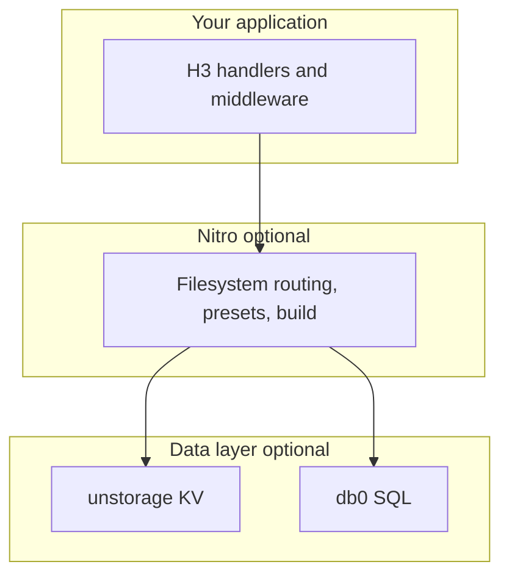

# Ecosystem

> How H3 fits into the broader UnJS server stack.

H3 is the HTTP layer: routing, middleware, request/response utilities, and Web Standard APIs. It is intentionally small. Other packages in the ecosystem add deployment, storage, databases, and tooling on top — often without changing the H3 APIs you write handlers with.

## Stack overview

You can use H3 alone with `serve()` or `app.fetch`. [Nitro](https://nitro.build) is the recommended full-stack layer when you need filesystem routing, code splitting, deployment presets, and built-in storage or database support.

## Core packages

| Package | Role | Docs |
|---------|------|------|
| [H3](https://h3.dev) | HTTP server framework (this project) | [h3.dev](https://h3.dev) |
| [Nitro](https://nitro.build) | Universal server toolkit built on H3 | [nitro.build](https://nitro.build) |
| [Rou3](https://github.com/h3js/rou3) | Route matcher used by H3 | [rou3](https://github.com/h3js/rou3) |
| [Srvx](https://srvx.h3.dev) | Runtime-agnostic server listener (`serve`) | [srvx](https://srvx.h3.dev) |

## Storage and data

| Package | Role | Used by |
|---------|------|---------|
| [unstorage](https://unstorage.unjs.io) | Runtime-agnostic key-value storage | Nitro `useStorage()`, H3 apps via direct import |
| [db0](https://db0.unjs.io) | Lightweight SQL connectors | Nitro `useDatabase()` |

In a Nitro app, prefer [Nitro storage](https://nitro.build/docs/storage) and [Nitro database](https://nitro.build/docs/database) over wiring these libraries manually — Nitro configures drivers from your `nitro.config`.

## Runtime compatibility

| Package | Role |
|---------|------|
| [unenv](https://github.com/unjs/unenv) | Node.js compatibility presets for non-Node runtimes |
| [unimport](https://github.com/unjs/unimport) | Auto-imports (used by Nitro for `defineHandler`, etc.) |

## When to use what

- **H3 only** — microservices, custom servers, embedding HTTP in another tool, or learning the request lifecycle.
- **Nitro** — full-stack apps, multi-provider deployment, filesystem routing, prerendering, and integrated storage/cache/database.
- **Nuxt** — Vue full-stack apps; Nuxt uses Nitro as its server engine. Server routes and middleware are H3-compatible.

:read-more{to="https://nitro.build" title="Nitro documentation"}
